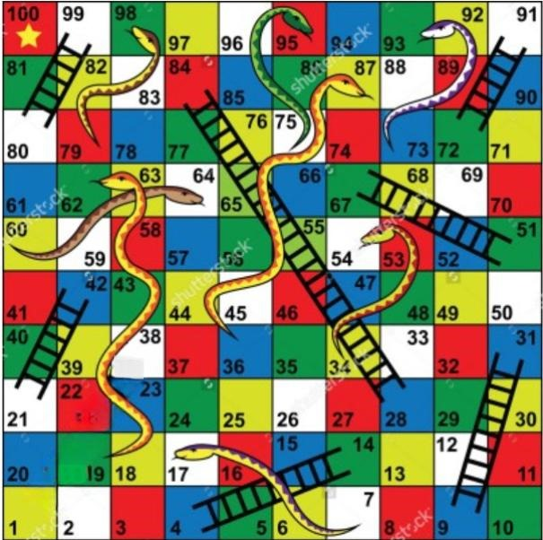

# Snake-and-Ladder-Game-AI-Agent

🎲 A Python-based Snake and Ladder game AI agent that uses the **Breadth-First Search (BFS)** algorithm to compute the minimum number of moves required to win. The game includes a Tkinter GUI and board image visualization.

This project demonstrates the application of **Artificial Intelligence (AI)** principles to solve the classic **Snake and Ladder** board game problem using graph traversal.

---

## 🎯 Objective

To develop an AI agent that:
- Analyzes board states intelligently
- Utilizes BFS to determine the shortest path (minimum dice throws)
- Prioritizes ladders to climb forward
- Avoids snakes that pull the player backward
- Visually simulates the gameplay with GUI interaction

---

## 🧮 AI Strategy

### 📌 Graph-Based Representation:
- Each square (1 to 100) is treated as a **node** in a directed graph.
- Dice throws (1–6) define possible **edges** from each node.
- **Ladders**: Redirect the edge to a higher-numbered node.
- **Snakes**: Redirect the edge to a lower-numbered node.
- **BFS** ensures the shortest path (fewest dice throws) is found from square 1 to 100.

---

## 🧠 Algorithm Used: Breadth-First Search (BFS)

### Steps:
1. Initialize a queue with the start node (1), move count, path, and dice rolls.
2. Explore nodes level by level using dice outcomes (1 to 6).
3. Apply ladder or snake transformations, if present.
4. Keep track of visited nodes to prevent cycles.
5. Stop when square 100 is reached and return the optimal path.

---

## 🖥️ GUI Features

- Developed using **Tkinter**
- Background board image support (`Board.jpg`)
- Visual token movement representing the AI's path
- Displays:
  - Player’s current position
  - Minimum number of moves
  - Path taken
  - Dice rolls used

---

## 🧪 Demo

> Ensure `Board.jpg` is present in your project directory for correct rendering.



---

## 📁 Project Structure

```

.
├── AI\_CaseStudy.docx                   # Case study document
├── Snake-and-Ladder-Game-AI-Agent.pptx # Presentation slides
├── Board.jpg                           # Game board background image
├── snake\_ladder\_ai.py                  # Main Python code (GUI + BFS)
└── README.md                           # Project documentation

````

---

## 🔧 Requirements

- Python 3.x
- `tkinter` (usually pre-installed with Python)
- `Pillow` (for image handling)

### Install dependencies:

```bash
pip install pillow
````

---

## 🚀 Run the Application

```bash
python snake_ladder_ai.py
```

---

## 📚 References

* **Russell, Stuart & Norvig, Peter** — *Artificial Intelligence: A Modern Approach*
* [GeeksforGeeks – BFS for Snake and Ladder](https://www.geeksforgeeks.org/snake-ladder-problem-2/)
* University of Alberta – *AI for Games* (Coursera)

---

## 🤖 AI Tools Used

* **Gamma AI** – Used for generating visually appealing and interactive presentation slides with AI assistance.

---

## 👥 Team

| Name                   | Roll Number      |
| ---------------------- | ---------------- |
| Kosuri Bhavya Naga Sai | CB.EN.U4CSE22328 |
| Krishnam Abhina        | CB.EN.U4CSE22331 |

---

## 📄 License

This project is intended for educational and academic use only.

```

### 📌 Tips:
- You can copy this directly into your `README.md` file.
- Make sure `Board.jpg` is committed to the GitHub repository for the image to display.
- You can enhance it further by adding GitHub badges or a GIF if needed.

Let me know if you’d like help creating a badge section or an animated demo!
```
